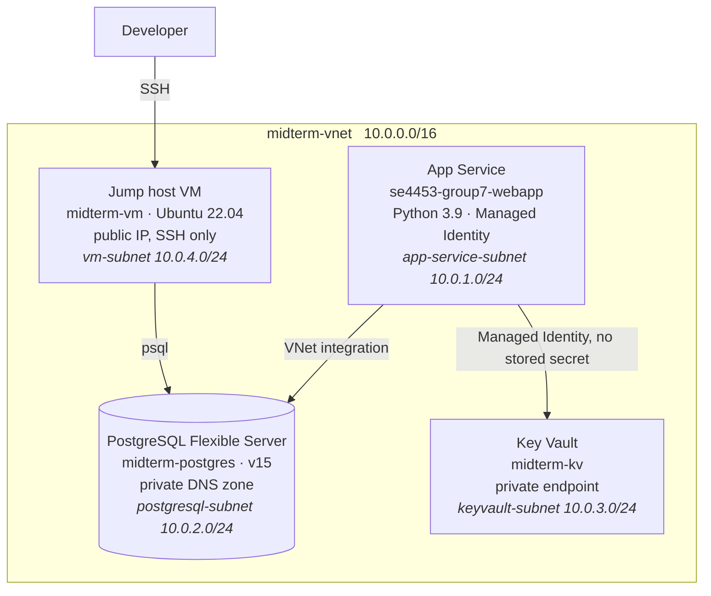

# Azure Private VNet Flask

A Flask service on Azure with no public data surface. The App Service, the PostgreSQL Flexible
Server and the Key Vault all sit inside one VNet: the database has no public endpoint and is
reachable only through a jump-host VM, and the vault is behind a private endpoint. The App
Service reads its database credentials from Key Vault over a Managed Identity, so no secret
lives in the image or in app settings.

The application itself is deliberately small — three routes, one of which just proves the
container reached the database. The work is the network topology, and the fact that every
`az` command that built it is committed and reproducible.

## Topology



Nothing but the VM's SSH port is reachable from outside the VNet. Administrative access to
the database goes developer → VM → Postgres; the application never leaves the VNet at all.

## Routes

| Route | Returns |
|---|---|
| `/` | `{"message": "App is running"}` — liveness, no dependencies |
| `/hello` | The resolved `APP_ENV`, `DB_HOST` and `DB_NAME`, to confirm which config the container picked up |
| `/db-test` | Opens and closes a real connection, so a success here means the private path to Postgres works |

## Local development

```bash
python -m venv venv
source venv/bin/activate        # Windows: venv\Scripts\activate
pip install -r requirements.txt
```

The app reads everything from the environment:

```bash
export DB_HOST=localhost
export DB_NAME=your_db
export DB_USER=your_user
export DB_PASSWORD=your_password
export DB_PORT=5432
export APP_ENV=development

python app.py                   # http://localhost:5000
```

In Azure these same variables are Key Vault references
(`@Microsoft.KeyVault(SecretUri=...)`), resolved by the App Service at startup through its
Managed Identity — the application code does not know Key Vault exists.

## Where the detail lives

| File | Contents |
|---|---|
| `docs/commands.md` | Every `az` command used to build the environment, in order |
| `docs/architecture.md` | Design decisions and Git workflow |
| `docs/resources.md` | Full resource inventory — names, SKUs, subnets, address spaces |
| `Command History.md` | Raw terminal transcript of the provisioning session (credentials and subscription IDs redacted) |

The Azure resources described here have been torn down; the documentation is kept as a
reproducible record, not as a pointer to a running system.

---

Built for SE4453, Group 7 — Spring 2025–2026.
